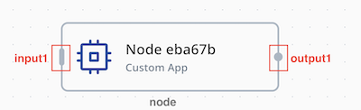

# NeoEdgeX App SDK v4 第三方開發指南

> 最新版本變更見[文末版本變更紀錄](#版本變更紀錄)。

## 這個 SDK 是什麼

NeoEdgeX App SDK v4 是用來開發 NeoEdgeX 節點應用程式的 Go SDK，支援 driver、protocol adapter、forwarder、processor 等節點類型。SDK 提供統一的執行模型：

- 透過 `ctx.Messages()` 接收來自 NeoFlow 的上游訊息
- 透過 `ctx.NodeConfig()` 讀取節點設定
- 透過 `ctx.Publish(...)` 發布下游輸出
- 透過 `ctx.ReportError(...)` 回報執行錯誤

節點生命週期、訊息傳輸、心跳、錯誤回報、關閉流程，以及 mock 模式，由 SDK 統一處理。

## 公開可依賴邊界

第三方應用程式只應依賴以下公開套件：

- `neoedgex`：app 進入點、handler 介面，以及 handler 會用到的型別
- `neoedgex/contract`：schema 型別，即 `DataType` 與其 `Type*` 常數、`PortFieldSchema`、`NodeData`；以及 publisher 必須照著產出的格式，目前是 `PublishTimestampLayout`
- `neoedgex/mock`：本地 mock 執行用的設定格式
- `neoedgex/testutil`：`NodeEnv` 測試替身與訊息建構器，供單元測試使用；正式 app entrypoint 不需要 import

`neoedgex` 中 handler 會用到的 `Node`、`Message`、`Logger`、`ErrorCode`，都是 `contract` 同名型別的 alias——同一個型別，兩種寫法可混用，只讀值、發布值的 app 完全不需要 import `contract`。一旦要在 Go 程式碼裡指名 schema 型別就需要它，例如在測試裡組出節點設定，或走訪 `NodeConfig().Data.Inputs`。

本指南涵蓋的公開入口：

- `neoedgex.New(handler)`
- `(*App).Run()`
- `(*App).EnableMock(...)`
- `(*App).DisableSDKLog()`
- `neoedgex.LoadMockConfig(...)`
- `neoedgex.NodeHandler`
- `neoedgex.NodeEnv`
- `neoedgex.Node`
- `neoedgex.Message`，含 `ToMap()` 與 `ToStruct(...)`
- `neoedgex.Logger`
- `neoedgex.ErrorCode`
- `contract.DataType` 與 `Type*` 常數
- `contract.PortFieldSchema`、`contract.NodeData`
- `contract.PublishTimestampLayout`
- `mock.LoadConfig(...)`
- `testutil.MockNodeEnv`，含 `NewMessage(...)` 與 `Deliver(...)`
- `testutil.NewMessage(...)`、`testutil.Fields`、`testutil.Field`、`testutil.Undeclared`

repo 裡的其餘路徑一律不可依賴，`internal/` 尤其如此：不屬於 SDK 契約，任何版本都可能改動。

## 最小可用範例

實作 `neoedgex.NodeHandler`，透過 `neoedgex.New(...).Run()` 啟動。

```go
package main

import (
	"log"

	"github.com/eCloudEdge-Digital/neoedgex-v4-app-sdk-go/v2/neoedgex"
)

type ExampleApp struct{}

func (app *ExampleApp) Handle(ctx neoedgex.NodeEnv) {
	for range ctx.Messages() {
		if err := ctx.Publish("output1", map[string]any{
			"power": 42.0,
		}); err != nil {
			ctx.ReportError(neoedgex.CodeProcessError, err)
		}
	}
}

func main() {
	if err := neoedgex.New(&ExampleApp{}).Run(); err != nil {
		log.Fatal(err)
	}
}
```

handle 與 key 不能隨意命名：`Publish` 依節點的 output schema 建構 payload，所以這段範例只有在節點的 `output1` 有宣告 `power` 欄位時才會真的送出東西。schema 未宣告的 key 會被丟棄——下游收不到東西時，這是第一個該檢查的地方。詳見下方 Output Schema。

停用 SDK 內部 log，在 `Run()` 前呼叫 `DisableSDKLog()`：

```go
app := neoedgex.New(&ExampleApp{}).DisableSDKLog()
if err := app.Run(); err != nil {
	log.Fatal(err)
}
```

它只會關掉 SDK 自己輸出的 log。handler 透過 `ctx.Logger()` 寫出的內容照常輸出。

## 如何設定 Custom App

SDK 從固定根路徑 `/opt/neoedgex` 讀取平台掛載的檔案：

- `/opt/neoedgex/config/messenger.json`：平台產生的 MQTT 帳號密碼；broker 依此帳號套用 topic 權限。以唯讀掛載，app 無法也不需修改。
- `/opt/neoedgex/config/config.json`：平台下發的節點設定，SDK 透過 `ctx.NodeConfig()` 提供給 handler

Custom App node 的設定來自 `ctx.NodeConfig()` 回傳的節點定義，分三個區塊：

1. `config.data.inputs`
2. `config.data.outputs`
3. `config.data.settings`

### Input Schema

input schema 定義在 `config.data.inputs`：

```json
{
  "inputs": {
    "input1": [
      { "key": "temperature", "type": "double" }
    ],
    "input2": [
      { "key": "running", "type": "bool" }
    ],
    "input3": [
      { "key": "capturedAt", "type": "string" }
    ]
  }
}
```


可以同時定義多個 input handle，每個 handle 各自帶獨立的欄位 schema；handler 透過 `msg.Handle` 判斷訊息來自哪一個 input。

input schema 描述 handler 從 `ctx.Messages()` 讀到的欄位。每個欄位包含：

- `key`：handler 從解碼後的訊息讀到的欄位名稱
- `type`：欄位的資料型態，完整決定解碼後的 Go 值

調整 input schema，就是在改變 handler 對該 handle 呼叫 `msg.ToMap()` 或 `msg.ToStruct(...)` 時，SDK 會依 schema 型別解碼哪些 key。handler 讀取的 key 應與這份定義保持一致，實際的 Go 型別則由 SDK 依 `type` 解碼決定。

### Output Schema

output schema 定義在 `config.data.outputs`：

```json
{
  "outputs": {
    "output1": [
      { "key": "power", "type": "double" },
      { "key": "status", "type": "string" }
    ]
  }
}
```

可以同時定義多個 output handle，每個 handle 各自帶獨立的欄位 schema；handler 透過 `ctx.Publish(handle, data)` 的第一個引數選擇要送往哪一個 output。

這份 schema 決定 `ctx.Publish(handle, map[string]any{...})` 的驗證與轉換行為：

- publish 的 map key 需和該 `handle` 所定義的 key 一致
- destination `type` 決定可接受哪些 Go 值，以及如何轉換
- schema 中被省略的欄位，SDK 送出 CBOR null（= undefined）
- 明確傳入 `nil` 的欄位，同樣送出 CBOR null

新增、刪除或改名欄位後，需同步更新 `ctx.Publish(...)` 的呼叫。


### Settings

執行設定定義在 `config.data.settings`，對應的 `docker-compose.yml` 欄位如下：

- `containerName`：同時影響 service key 與 `container_name`
- `image`：service 的 `image`
- `envVars`：service 的 `environment`
- `files`：`volumes` 下的額外 bind mounts
- `devices`：service 的 `devices`
- `gpu.enabled=true`：為 service 加上 `gpus`
- `portBindings`：service 的 `ports`

以下欄位屬於 node settings，不直接出現在 compose service 中：

- `credentials`：`neoedgex-agent` 用這組 credential 登入 docker registry，拉取 `image` 指定的 image

對應的 `docker-compose.yml` 範例：

```yaml
name: neoedgex
services:
  7719d4f0cc984dd6:
    container_name: 7719d4f0cc984dd6
    depends_on:
      neoedgex-messenger:
        condition: service_started
        required: true
    devices:
      - source: /dev/ttyUSB0
        target: /dev/ttyUSB0
        permissions: rw
    environment:
      a: b
    gpus:
      - capabilities:
          - gpu
        driver: nvidia
        count: -1
    image: 192.168.64.202:5001/busybox:stable
    networks:
      neoedgex-network: null
    restart: always
    ports:
      - target: 80
        published: "8080"
        protocol: tcp
    volumes:
      - type: bind
        source: ...
        target: /opt/neoedgex/config
        read_only: true
      - type: bind
        source: ...
        target: /var/myfile/ca-copy.crt
        read_only: true
```

### 傳遞 App Config

app 從環境變數或掛載檔案讀取業務設定；SDK 負責把這些內容帶進容器，但不解析 app 的 business config。

#### 模式 A：用固定 key 的 env var 當 config

適合：

- 小型設定
- 單一字串或 JSON blob
- 少量、容易直接放進 environment 的設定

在 `settings.envVars` 定義固定 key：

```json
"envVars": [
  {
    "key": "HTTPCLIENT_CONFIG_JSON",
    "value": "{\"endpoint\":\"https://api.example.com/ingest\",\"method\":\"POST\"}",
    "note": "app business config"
  }
]
```

app 讀取固定 key：

```go
raw := os.Getenv("HTTPCLIENT_CONFIG_JSON")
if raw == "" {
    return fmt.Errorf("HTTPCLIENT_CONFIG_JSON is required")
}
```

也可以拆成多個獨立的 env var：

```json
"envVars": [
  {
    "key": "HTTPCLIENT_ENDPOINT",
    "value": "https://api.example.com/ingest",
    "note": "HTTP endpoint"
  },
  {
    "key": "HTTPCLIENT_METHOD",
    "value": "POST",
    "note": "HTTP method"
  },
  {
    "key": "HTTPCLIENT_TIMEOUT_SECONDS",
    "value": "10",
    "note": "request timeout"
  }
]
```

```go
endpoint := os.Getenv("HTTPCLIENT_ENDPOINT")
method := os.Getenv("HTTPCLIENT_METHOD")
timeoutRaw := os.Getenv("HTTPCLIENT_TIMEOUT_SECONDS")
```

#### 模式 B：用固定路徑的檔案當 config

適合：

- 較大的 JSON / YAML
- 結構化設定
- 憑證、key、secret file
- 需要以檔案形式人工替換或掛載的內容

在 `settings.files` 宣告固定路徑：

```json
"files": [
  {
    "uuid": "app-config-file",
    "path": "/myconfig.json",
    "secret": "false"
  }
]
```

app 直接讀該路徑：

```go
payload, err := os.ReadFile("/myconfig.json")
if err != nil {
    return fmt.Errorf("read /myconfig.json: %w", err)
}
```

#### 選擇 env var 或 file

- 小型、單值、少量 JSON：優先用 env var
- 較大或結構化 config：優先用 file
- 憑證、key、secret file：通常用 file
- 同時支援 env 與 file 時，在 app 內明確定義固定優先順序，例如 env 先、file 後

SDK 不決定這個優先順序；這是 app 自身的 contract，應在 app 文件中明確說明。

## 訊息模型

NeoFlow 節點之間透過 MQTT 互相傳訊息：一則資料訊息就是一個 MQTT payload，內容以 CBOR（一種精簡的二進位格式）編碼。這個 payload 不需要你自己組出來或自己拆解——`msg.ToMap()` / `msg.ToStruct(...)` 負責解碼收到的內容，`ctx.Publish(...)` 負責編碼要送出的內容。本節說明的就是這兩端：handler 從 `ctx.Messages()` 收到什麼，以及 `Publish` 送出什麼。

### 術語

- `node`：一個被這個 app 匹配到的 NeoEdgeX 節點設定
- `handle`：input 或 output port 名稱，例如 `input1`、`output1`
- `tag`：input 或 output schema 裡的一個具名欄位，即 `key` / `type` 這一組，例如 `{ "key": "temperature", "type": "double" }`
- `mock mode`：SDK 的本地模擬模式，不需要真實平台就能注入假訊息


### NodeEnv 與 Message

每個 handler 會收到一個 `neoedgex.NodeEnv`。

`NodeEnv` 提供：

- `NodeConfig()`：原始節點設定，含 `Data.Settings`、`Data.Inputs`、`Data.Outputs`
- `Messages()`：接收進來的 `neoedgex.Message`
- `Context()`：這個 node 的生命週期 context，用於 HTTP、DB、gRPC、worker loop 等呼叫
- `Logger()`：node-scoped logger
- `Publish(handle string, data map[string]any)`：送出到指定的 output handle
- `ReportError(code, err)`：回報平台可見的 node error
- `Stop()`：要求 SDK 停止這個 node，用於 handler 遭遇無法繼續的 fatal error

`neoedgex.Message` 包含：

- `Handle`：觸發此訊息的 input handle 名稱
- `Data`：`RawMessage`，原樣持有這則訊息的 `data` 段，內容仍是 CBOR 編碼；不直接讀取，而是以 `msg.ToMap()` 或 `msg.ToStruct(...)` 解碼取值
- `Source`：來源節點 ID
- `Timestamp`：上游節點 publish 的時間，RFC3339 格式。本版 SDK 的節點以 UTC 寫入毫秒精度，因此結尾為 `Z`（`2026-03-22T10:30:00.123Z`）。SDK 原封不動地傳遞這個字串且從不驗證，因此其形式取決於發送端：舊版 SDK 的節點寫入秒精度、不帶小數位；時鐘不在 UTC 的節點寫入本地時區偏移（例如 `+08:00`）。請以 `time.RFC3339` layout 解析，上述形式皆可接受。上游 payload 完全未帶時間時為空字串

### 讀取 Input 值

`msg.Data` 持有這則訊息的 `data` 段，內容仍是 CBOR 編碼。呼叫 `msg.ToMap()` 解碼成含 Go 原生值的 `map[string]any`：

- input schema 宣告的每個欄位，都以該 tag 所宣告的 `type` 對應的具體 Go 型別解碼（見下表）
- 欄位為 `nil` 代表 **undefined**：上游節點未輸出該欄位（CBOR null）、收到的訊息裡沒有這個 key，或收到的值無法讀取或轉換成 schema 型別
- 收到的值型別與 schema 型別不符時，SDK 以與 Publish 側相同的跨型別轉換規則轉換（整數範圍檢查、float→int 截斷、string→number parse、拒絕 NaN/Inf）；規則不允許或轉換失敗時，該欄位交付 `nil`
- 出現在收到的訊息裡、但**未**在 input schema 宣告的 key，直接交付解碼器產生的 Go 值（見下方表格），並輸出 debug log；SDK 沒有對應 Go 型別的值則交付 `nil`

讀取時需先依 `msg.Handle` 判斷訊息來自哪一個 input，再判斷欄位 key 是否存在，以及 value 是否為 `nil`。

以 input schema 宣告一個 `double` 欄位與一個 `string` 欄位為例，解碼結果如下：

```go
msg := <-ctx.Messages()
// msg.Handle == "input1"、msg.Source == "upstream-node"

data := msg.ToMap()
// data == map[string]any{
// 	"temperature": 25.5,       // schema type double -> float64
// 	"deviceName":  "sensor-1", // schema type string -> string
// }
```

訊息一律從 `ctx.Messages()` 取得。自己用 struct literal 組出來的 `neoedgex.Message` 既沒有資料也沒有 input schema，對它呼叫 `ToMap()` 什麼都拿不到；要在測試裡建立訊息，請用 `testutil.NewMessage`（見「單元測試輔助」）。

讀取時對每個欄位套用相同的防禦式流程：先判斷 key 是否存在，再判斷 value 是否為 `nil`，最後做型別斷言。以 `temperature` 為例：

```go
func (app *ExampleApp) Handle(ctx neoedgex.NodeEnv) {
	for msg := range ctx.Messages() {
		data := msg.ToMap()
		switch msg.Handle {
		case "input1":
			var temperature float64
			if value, exists := data["temperature"]; !exists {
				ctx.ReportError(neoedgex.CodeProcessError, fmt.Errorf("internal error: input1 schema 未定義 tag temperature"))
				continue
			} else if value == nil {
				ctx.ReportError(neoedgex.CodeProcessError, fmt.Errorf("temperature 未由上游節點成功輸出"))
				continue
			} else if castedValue, ok := value.(float64); !ok {
				ctx.ReportError(neoedgex.CodeProcessError, fmt.Errorf("internal error: tag temperature 型別不符，預期 float64"))
				continue
			} else {
				temperature = castedValue
			}
			_ = temperature

		default:
			// 未在 schema 中定義的 handle，忽略即可
			continue
		}
	}
}
```

其他型別的斷言只是把目標 Go 型別換掉，流程相同。

解碼後 map 的語意：

- `!exists`：可能是 app 讀取了 input schema 未定義的 tag（屬於 internal error），也可能是整段 `data` 讀不出來——此時 `ToMap()` 什麼都不回，所有 key 都會不存在
- `exists && value == nil`：欄位為 undefined——前一個 node 未成功輸出該 tag、收到的訊息裡沒有這個 key，或值無法讀取或轉換成 schema 型別；由 app 決定套預設值、跳過或回報 error
- `exists && value != nil`：可進行型別判斷，Go 型別依下方兩張表決定

#### 值會以什麼 Go 型別交付

**tag 已在 input schema 宣告。** 有值時，以宣告 `type` 對應的 Go 型別交付；沒有值時交付 `nil`，如表格下方兩條規則所述：

| type | handler 讀到的 Go 型別 |
| --- | --- |
| `bool` | `bool` |
| `int16` | `int16` |
| `int32` | `int32` |
| `int64` | `int64` |
| `uint16` | `uint16` |
| `uint32` | `uint32` |
| `uint64` | `uint64` |
| `float` | `float32` |
| `double` | `float64` |
| `string` | `string` |
| `raw` | `[]byte` |

表格之外還有兩條規則：

- 上游以單精度送出的小數進到 `double` tag，或以雙精度送出的小數進到 `float` tag 時，SDK 以轉換規則正規化，並還原最短小數：以單精度送出的 `25.34` 進到 `double` tag，交付為 `25.34`，不是 `25.34000015258789`
- 值放不進宣告的型別時——例如 `1e300` 進到 `float` tag——轉換失敗，該欄位交付 `nil`

**tag 未在 input schema 宣告。** 值直接以解碼器產生的樣子交付，不做 schema 轉換。以這種方式交付的 Go 型別只有下列幾種：

| 上游送出的內容 | handler 讀到的 Go 型別 |
| --- | --- |
| 小數，不分精度 | `float64` |
| 0 到 9223372036854775807 的整數 | `int64` |
| 9223372036854775808 到 18446744073709551615 的整數 | `uint64` |
| 到 -9223372036854775808 為止的負整數 | `int64` |
| 文字 | `string` |
| `true` / `false` | `bool` |
| 二進位資料 | `[]byte` |
| 其他任何值——清單、巢狀結構，或超出上述範圍的整數 | `nil`（undefined） |

單精度值在這裡會被拓寬：以單精度送出的 `25.34` 交付為 `25.34000015258789`。要避免這件事，就把該 tag 宣告到 input schema。

最後一列是一條封閉規則：上表列出的 Go 型別就是 SDK 會交付的全部，其餘一律交付 `nil`，key 仍在，並輸出 warning log。清單與巢狀結構一律不交付——沒有任何 tag type 可以宣告它們，只會來自非本 SDK 的發送端，而且是整個值交付成一個 `nil`，不會只交付其中一部分。實務上會遇到的是整數——只有落在上表範圍內的整數才會以數字交付。

**任何 SDK 無法解碼、轉換或表達的值，一律交付 `nil`。** key 仍留在 map 裡、值為 `nil`。所有「沒值」的情況都是同一條規則：上游未輸出值、收到的訊息裡沒有這個 key、值放不進宣告的型別、值根本讀不出來，或該值沒有 SDK 會交付的 Go 型別。

只有一種情況 key 根本不在 map 裡：整段 `data` 讀不出來的訊息，也就是 payload 損毀的樣子。此時 `ToMap()` 什麼都不回——連 schema 宣告的 key 都沒有——`ToStruct(...)` 則回傳 error。

### 解碼成 Struct

`msg.ToStruct(&target)` 把 data 段直接解進 struct。

**欄位比對依序使用 `cbor` struct tag、`json` tag、欄位名稱，且大小寫精確。** 欄位 `Temp` 不會被 key `temp` 填入；Go 匯出欄位一定是大寫開頭，而 key 慣例上不是，因此**每個欄位實質上都需要 tag**。沒有 tag 的欄位會靜靜停在零值，`ToStruct` 也不會回報 error。請寫 `cbor:"temperature"`，或直接沿用 struct 上既有的 `json:"temperature"`：`cbor` tag 只要不是空字串就自己決定 key，`json` tag 只在沒有 `cbor` tag 時才會被讀，所以 `cbor:",omitempty" json:"level"` 比對的是欄位名稱，不是 `level`。在最終生效的那個 tag 裡，名稱後面的選項會被去掉——`json:"level,omitempty"` 比對的 key 是 `level`——值剛好是 `-` 則跳過該欄位，`json:"-,"` 則是把 key 命名為 `-`。

具體型別的欄位，若宣告的 Go 型別正好是該 key 的 schema `type` 對應的型別，收到的值與 `msg.ToMap()` 對同一個 key 交付的完全一致，含跨型別轉換規則——宣告為 `double` 的 tag 以單精度送來時，`float64` 欄位讀到的是 `25.34`，不是 `25.34000015258789`。指標欄位依其元素型別判定。宣告型別與 schema 型別**衝突**時，以宣告為準：值直接以宣告的 Go 型別解碼（codec 內建範圍檢查，不套用轉換規則）。`any`（`interface{}`）欄位收到的值依上面兩張表決定：input schema 有宣告該 tag 時，是宣告 `type` 對應的 Go 型別；未宣告時，則是解碼器直接產生的 Go 值。

**undefined 語意——選擇欄位型別前務必先讀。** 收到的訊息裡沒有這個 key、或值為 undefined 時，`ToStruct` 不會碰該欄位，無論它是什麼型別。**非指標**欄位因此停在 Go 零值——把欄位宣告成非指標型別，等於**該欄位放棄「0 vs 沒值」的分辨力**：解碼後的 `0`、`""`、`false` 可能是上游真的輸出了零值，也可能是 undefined，struct 無法告訴你是哪一種。若 app 需要分辨，請把欄位宣告成**指標**（或 `any`）：undefined 會呈現為 `nil`，真正的零值則是指向零值的非 nil 指標。

值存在、但讀不出來或轉換不了，則是另一種情況，而且 `ToStruct` 在這裡**不會**跟 `msg.ToMap()` 一致。`any` 欄位停在 `nil`，與 map 相同；具體型別或指標欄位則會讓整個呼叫失敗：`ToStruct` 回傳帶欄位名稱的 error，因為 `float64` 或 `int16` 沒有地方可以擺「沒值」——`70000` 進到宣告為 `int16` 的欄位就是這種 error，而 map 對同一個值交付 `nil`。整段 `data` 讀不出來時也一樣。只要回傳 error，就丟棄該 struct、不要再讀它：失敗欄位之前的欄位保有已解出的值，之後的欄位則完全沒被處理。

下面的範例可以直接執行：把它包進自己 `_test.go` 裡的 `Example()` 函式，補上 `fmt`、`math`、`neoedgex/contract`、`neoedgex/testutil` 這幾個 import，`go test` 就會拿 `// Output:` 區塊替你比對。`testutil.NewMessage(...)` 建出的就是 handler 會從 `ctx.Messages()` 收到的那則訊息；在自己的 app 裡，`msg` 來自該 channel，解碼 error 也應交給 `ctx.ReportError(...)` 而不是印出來。

```go
// msg 是從 ctx.Messages() 收到的一則訊息，這裡由 testutil 在測試中建出同樣的東西。
// 每個值旁邊寫的是接收端節點 input schema 對該 key 宣告的型別——temperature 與
// offset 為 double、count 為 int64、ratio 為 float、level 為 double；
// testutil.Undeclared 則標記 schema 根本沒有宣告的 key。
msg := testutil.NewMessage("input1", testutil.Fields{
	"temperature": {Value: nil, Type: contract.TypeDouble},        // 上游未輸出值
	"offset":      {Value: float64(0), Type: contract.TypeDouble}, // 上游輸出了真正的 0
	"count":       {Value: nil, Type: contract.TypeInt64},         // 上游未輸出值
	"ratio":       {Value: float32(25.34), Type: contract.TypeFloat},
	"level":       {Value: float64(25.34), Type: contract.TypeDouble},
	"widened":     {Value: float32(25.34), Type: testutil.Undeclared},
	"seq":         {Value: uint64(5), Type: testutil.Undeclared},
	"total":       {Value: uint64(math.MaxUint64), Type: testutil.Undeclared},
	"deviceName":  {Value: "sensor-1", Type: testutil.Undeclared},
	"running":     {Value: true, Type: testutil.Undeclared},
	"payload":     {Value: []byte{0x01, 0x02}, Type: testutil.Undeclared},
})

type Reading struct {
	Temperature *float64 `cbor:"temperature"` // 指標：沒值 -> nil
	Offset      *float64 `cbor:"offset"`      // 指標：真正的 0 -> 指向 0 的指標
	Count       int64    `cbor:"count"`       // 非指標：沒值 -> 0
	Ratio       any      `cbor:"ratio"`       // 宣告為 float -> float32
	Level       any      `cbor:"level"`       // 宣告為 double -> float64
	Widened     any      `cbor:"widened"`     // 未宣告 -> float64
	Seq         any      `cbor:"seq"`         // 未宣告 -> int64
	Total       any      `cbor:"total"`       // 未宣告，超出 int64 -> uint64
	DeviceName  any      `cbor:"deviceName"`  // 未宣告 -> string
	Running     any      `cbor:"running"`     // 未宣告 -> bool
	Payload     any      `cbor:"payload"`     // 未宣告 -> []byte
}

var r Reading
if err := msg.ToStruct(&r); err != nil {
	fmt.Println("cannot decode this message:", err)
	return
}

if r.Temperature == nil {
	fmt.Println("Temperature: no value")
} else {
	fmt.Println("Temperature:", *r.Temperature)
}
if r.Offset == nil {
	fmt.Println("Offset: no value")
} else {
	fmt.Println("Offset:", *r.Offset)
}
fmt.Println("Count:", r.Count, "<- no value and a real 0 look the same here")
fmt.Printf("Ratio: %v (%T)\n", r.Ratio, r.Ratio)
fmt.Printf("Level: %v (%T)\n", r.Level, r.Level)
fmt.Printf("Widened: %v (%T)\n", r.Widened, r.Widened)
fmt.Printf("Seq: %v (%T)\n", r.Seq, r.Seq)
fmt.Printf("Total: %v (%T)\n", r.Total, r.Total)
fmt.Printf("DeviceName: %v (%T)\n", r.DeviceName, r.DeviceName)
fmt.Printf("Running: %v (%T)\n", r.Running, r.Running)
fmt.Printf("Payload: %v (%T)\n", r.Payload, r.Payload)

// Output:
// Temperature: no value
// Offset: 0
// Count: 0 <- no value and a real 0 look the same here
// Ratio: 25.34 (float32)
// Level: 25.34 (float64)
// Widened: 25.34000015258789 (float64)
// Seq: 5 (int64)
// Total: 18446744073709551615 (uint64)
// DeviceName: sensor-1 (string)
// Running: true (bool)
// Payload: [1 2] ([]uint8)
```

### Publish 規則

`Publish` 的行為：

- 依節點 `handle` 對應的 output schema 建構 payload；`handle` 須已在 `config.data.outputs` 中定義，否則回傳 error
- schema 中的欄位若未出現在 `data` 裡，SDK 送出 CBOR null（= undefined）
- 明確提供但值為 `nil` 的欄位，同樣送出 CBOR null
- `data` 裡不在該 output schema 中的 key 一律丟棄（log warning），不會出現在送出的 payload 裡
- `ctx.Publish(handle, map[string]any{...})` 接受一般的 Go 值；handler 從 `msg.ToMap()` 讀到的同樣是一般的 Go 值
- `Publish` 只有三種情況會回傳 error：`handle` 不在 `config.data.outputs` 中、payload 無法編碼、MQTT 發送失敗。欄位轉換失敗**不在其中**：該欄位以 CBOR null 送出，SDK 代為向平台回報，`Publish` 仍回傳 `nil`。不要把 `nil` 回傳值當成「每個欄位都照我的意思送出去了」

缺少 output 欄位時的具體例子：

```go
// output1 schema:
// - power: type=double
// - status: type=string

_ = ctx.Publish("output1", map[string]any{
	"power": 42.0,
})
```

SDK 用傳入的值建立 `power`，`status` 因未在 `data` 中出現而送出 CBOR null（下游 handler 讀到 `nil`＝undefined）。明確傳 `status: nil` 結果相同：

```go
err := ctx.Publish("output1", map[string]any{
	"power": 42.0,
	"status": nil,
})
if err != nil {
	ctx.ReportError(neoedgex.CodeProcessError, err)
}
```

### Go 值轉換

`ctx.Publish` 的轉換行為由傳入 handle 對應 schema 的 destination type 決定。轉換後的值以 destination type 的原生 CBOR 值送出。

<table>
  <thead>
    <tr>
      <th>Destination type</th>
      <th>Go 值類別</th>
      <th>轉換規則</th>
      <th>例子</th>
      <th>不接受 / 備註</th>
    </tr>
  </thead>
  <tbody>
    <tr>
      <td rowspan="2"><code>bool</code></td>
      <td><code>bool</code></td>
      <td>原樣保留。</td>
      <td><code>true -&gt; true</code></td>
      <td rowspan="2">不接受普通 <code>string</code>。</td>
    </tr>
    <tr>
      <td>有號整數、無號整數、浮點</td>
      <td>採用 zero / non-zero 規則：<code>0</code> 或 <code>0.0</code> 轉成 <code>false</code>；其他值都轉成 <code>true</code>。</td>
      <td><code>int64(0) -&gt; false</code>；<code>float64(3.14) -&gt; true</code></td>
    </tr>
    <tr>
      <td rowspan="4"><code>int16</code>、<code>int32</code>、<code>int64</code></td>
      <td>有號整數</td>
      <td>轉到目標位寬，並做 range check。</td>
      <td>destination <code>int64</code> + <code>int32(42) -&gt; int64(42)</code></td>
      <td rowspan="4"><code>NaN</code>、<code>Inf</code>、超出範圍的值、<code>time.Time</code>、<code>[]byte</code> 都會失敗。</td>
    </tr>
    <tr>
      <td>無號整數</td>
      <td>轉到目標位寬，並做 range check。</td>
      <td>destination <code>int32</code> + <code>uint32(42) -&gt; int32(42)</code></td>
    </tr>
    <tr>
      <td><code>float32</code>、<code>float64</code></td>
      <td>先截斷小數部分，再做轉換與 range check。</td>
      <td>destination <code>int64</code> + <code>float64(12.9) -&gt; int64(12)</code></td>
    </tr>
    <tr>
      <td><code>bool</code>、數字字串</td>
      <td><code>bool</code> 轉成 <code>1</code> 或 <code>0</code>。數字字串必須能被 parse 成目標型別。</td>
      <td>destination <code>int32</code> + <code>true -&gt; int32(1)</code>；destination <code>int16</code> + <code>"42" -&gt; int16(42)</code></td>
    </tr>
    <tr>
      <td rowspan="4"><code>uint16</code>、<code>uint32</code>、<code>uint64</code></td>
      <td>有號整數</td>
      <td>只有在結果非負且落在目標 uint 範圍內時，才可轉到目標位寬。</td>
      <td>destination <code>uint32</code> + <code>int32(42) -&gt; uint32(42)</code></td>
      <td rowspan="4">負值、<code>NaN</code>、<code>Inf</code>、超出範圍的值都會失敗。</td>
    </tr>
    <tr>
      <td>無號整數</td>
      <td>轉到目標 uint 位寬，並做 range check。</td>
      <td>destination <code>uint64</code> + <code>uint32(42) -&gt; uint64(42)</code></td>
    </tr>
    <tr>
      <td><code>float32</code>、<code>float64</code></td>
      <td>先截斷小數部分，再做 uint 範圍檢查與轉換。</td>
      <td>destination <code>uint64</code> + <code>float64(12.9) -&gt; uint64(12)</code></td>
    </tr>
    <tr>
      <td><code>bool</code>、數字字串</td>
      <td><code>bool</code> 轉成 <code>1</code> 或 <code>0</code>。數字字串必須能被 parse 成目標型別。</td>
      <td>destination <code>uint32</code> + <code>true -&gt; uint32(1)</code></td>
    </tr>
    <tr>
      <td rowspan="4"><code>float</code>、<code>double</code></td>
      <td>有號整數</td>
      <td>轉成目標浮點精度。</td>
      <td>destination <code>double</code> + <code>int64(42) -&gt; float64(42)</code></td>
      <td rowspan="4">不接受 <code>NaN</code>、<code>Inf</code>、<code>time.Time</code> 與 <code>[]byte</code>。</td>
    </tr>
    <tr>
      <td>無號整數</td>
      <td>轉成目標浮點精度。</td>
      <td>destination <code>double</code> + <code>uint32(42) -&gt; float64(42)</code></td>
    </tr>
    <tr>
      <td><code>float32</code>、<code>float64</code></td>
      <td>轉成目標精度。</td>
      <td>destination <code>float</code> + <code>float64(25.5) -&gt; float32(25.5)</code></td>
    </tr>
    <tr>
      <td><code>bool</code>、數字字串</td>
      <td><code>bool</code> 轉成 <code>1.0</code> 或 <code>0.0</code>。數字字串必須能被 parse 成目標浮點型別。</td>
      <td>destination <code>double</code> + <code>true -&gt; float64(1)</code>；destination <code>double</code> + <code>"3.14" -&gt; float64(3.14)</code></td>
    </tr>
    <tr>
      <td rowspan="4"><code>string</code></td>
      <td><code>string</code></td>
      <td>原樣保留。</td>
      <td><code>"neoedgex" -&gt; "neoedgex"</code></td>
      <td rowspan="4">不接受 <code>time.Time</code> 與 <code>[]byte</code>。</td>
    </tr>
    <tr>
      <td>有號整數、無號整數</td>
      <td>轉成十進位字串。</td>
      <td><code>42 -&gt; "42"</code></td>
    </tr>
    <tr>
      <td><code>float32</code>、<code>float64</code></td>
      <td>轉成 scientific notation 字串。</td>
      <td><code>25.5 -&gt; "2.55e+01"</code></td>
    </tr>
    <tr>
      <td><code>bool</code></td>
      <td>轉成 <code>"true"</code> 或 <code>"false"</code>。</td>
      <td><code>true -&gt; "true"</code></td>
    </tr>
    <tr>
      <td><code>raw</code></td>
      <td><code>[]byte</code></td>
      <td>以 CBOR 原生 byte string 送出（不做 base64）。只允許 <code>raw</code> 轉 <code>raw</code>；沒有其他型別能轉入或轉出 <code>raw</code>。</td>
      <td><code>[]byte("hello")</code> 逐 byte 保留。</td>
      <td>其他 Go 型別都不支援。</td>
    </tr>
  </tbody>
</table>

上表的「有號整數」「無號整數」指的是所有 Go 整數 kind，包含 `int`、`uint`、`int8`、`uint8`——所以 `ctx.Publish(handle, map[string]any{"count": 5})`（無型別常數會落在 `int`）會和其他整數一樣轉成宣告的 tag type。放寬接受的 Go kind 並沒有放寬 tag type：範圍檢查完全相同，`int(70000)` 送進 `int16` 欄位一樣失敗。

不是單一純量的值——map、struct、`[]byte` 以外的 slice、`json.RawMessage`、`time.Time`——對所有 destination type 一律拒絕：SDK 回報 error，該欄位送出 CBOR null。時間值請先在 app 內轉成字串（如 `t.Format(time.RFC3339)`），並把欄位宣告為 `string`。

SDK 依據 Go 值與 schema 的 destination type 決定是否可轉換。身為第三方 app 開發者，通常只需要關心傳入的 Go 值能不能被目標 schema 型別接受。

假設 `output1` schema 定義了這個欄位：

```text
- enabled: type=bool
```

若這樣 publish：

```go
err := ctx.Publish("output1", map[string]any{
	"enabled": 9527,
})
```

SDK 套用 `bool` 的 zero / non-zero 規則，`enabled` 轉成 `true`。

但若改成這樣 publish：

```go
err := ctx.Publish("output1", map[string]any{
	"enabled": "true",
})
```

`Publish` 不因此回傳 error；SDK 把 `enabled` 以 CBOR null（undefined）送出，並呼叫 `ReportError` 回報平台，`Publish` 仍回傳 `nil`。

### Publish 流程

以下是完整的 end-to-end 範例，說明 Go 值如何從 handler 流向下游節點。

步驟 1：從 `output1` schema 開始。這個例子假設 `output1` 定義如下：

```text
- temperature: type=double
- running: type=bool
- capturedAt: type=string
```

步驟 2：handler 透過 `ctx.Publish(...)` 發布一般的 Go 值。`string` 欄位預期收到 Go `string`：

```go
func (app *ExampleApp) Handle(ctx neoedgex.NodeEnv) {
	for range ctx.Messages() {
		if err := ctx.Publish("output1", map[string]any{
			"temperature": 25.5,
			"running":     true,
			"capturedAt":  "2026-03-22T10:30:00Z",
		}); err != nil {
			ctx.ReportError(neoedgex.CodeProcessError, err)
		}
	}
}
```

步驟 3：SDK 在 publisher 這一側把 Go 值轉成 schema 型別後，把整則訊息編碼成 CBOR。訊息最外層有三個欄位：`source`（發送的節點）、`timestamp`（發送當下的時間，RFC3339 格式、精度到毫秒，取自容器的時鐘並轉為 UTC，因此結尾一律是 `Z`）與 `data`（你 publish 的欄位）。以下以 CBOR diagnostic notation（CBOR 的人類可讀表示法）呈現——每個欄位直接帶原生值，沒有 per-field type 包裝：

```text
{
  "source": "publisher-node",
  "timestamp": "2026-03-22T10:30:00.123Z",
  "data": {
    "temperature": 25.5,
    "running": true,
    "capturedAt": "2026-03-22T10:30:00Z"
  }
}
```

步驟 4：下游 node 在 `input1` 收到後，handler 以 `msg.ToMap()` 解碼，每個欄位以下游 input schema 的具體 Go 型別交付：

```go
msg := <-ctx.Messages()
// msg.Handle == "input1"、msg.Source == "publisher-node"、msg.Timestamp == "2026-03-22T10:30:00.123Z"

data := msg.ToMap()
// data == map[string]any{
// 	"temperature": 25.5,                   // double -> float64
// 	"running":     true,                   // bool -> bool
// 	"capturedAt":  "2026-03-22T10:30:00Z", // string -> string
// }
```

## Mock 開發流程

mock mode 適合本地開發與整合測試，不需要真實 NeoEdgeX 平台。

```go
package main

import (
	"log"

	"github.com/eCloudEdge-Digital/neoedgex-v4-app-sdk-go/v2/neoedgex"
	"github.com/eCloudEdge-Digital/neoedgex-v4-app-sdk-go/v2/neoedgex/mock"
)

func main() {
	app := neoedgex.New(&ExampleApp{})

	config, err := mock.LoadConfig("./mock-config.json")
	if err != nil {
		log.Fatal(err)
	}
	app.EnableMock(config)

	if err := app.Run(); err != nil {
		log.Fatal(err)
	}
}
```

最小 mock config：

```json
{
  "nodes": [
    {
      "id": "node-1",
      "type": "app",
      "data": {
        "name": "demo-node",
        "inputs": {
          "input1": [
            { "key": "temperature", "type": "double" }
          ]
        },
        "outputs": {
          "output1": [
            { "key": "value", "type": "string" }
          ]
        },
        "application": {
          "key": "demo-app",
          "version": "2.0.0"
        },
        "settings": {}
      }
    }
  ],
  "mock": {
    "messageInterval": "3s",
    "messages": [
      {
        "nodeID": "node-1",
        "handle": "input1",
        "data": {
          "temperature": {
            "type": "double",
            "value": "2.55e+01"
          }
        }
      }
    ]
  }
}
```

這份檔案必須注意的地方：

- `mock.messages[].nodeID` 必須與某個 `nodes[].id` 完全相同，`handle` 也應是同一個節點在 `inputs` 中宣告過的。`nodeID` 對不上任何節點時什麼都不會送達，唯一的線索是 log 裡的 `[MOCK INJECT] error: no subscriber for node ...` warning。節點未宣告的 `handle` 仍會送達，但背後沒有 input schema，所有值都不帶型別。
- 訊息每個 tick 注入一則，從清單頭開始輪替；app 啟動後約半秒開始。要同時測多個 input，就每個 input 各列一則訊息，讓它們輪流注入。
- `messageInterval` 是 Go duration 字串，例如 `"3s"`、`"500ms"`。未填、無法解析或非正值時，一律退回 3s，且不報錯。
- 注入的值維持字串化的 `type`/`value` 形式：浮點用科學記號（`"2.55e+01"`）、`raw` 用 base64、bool 用 `"true"` / `"false"`。SDK 在注入時把每筆值轉成原生 Go 值，handler 讀到的解碼結果與正式環境一致。`type` 留空的欄位會注入成 undefined，這就是測試 `nil` 路徑的方法。
- 注入的訊息一律帶 `Source` `"mock"`，`Timestamp` 取自注入當下的本機時鐘，格式與真實 publisher 相同，是 UTC 毫秒形式。
- 沒有真實 broker，因此 handler publish 的內容只看得到 log：`[MOCK PUBLISH]` 行會帶出 topic 與解碼後的 payload。heartbeat 也以同樣形式出現，payload 為空。呼叫 `DisableSDKLog()` 會把這些全部關掉。

`neoedgex.LoadMockConfig(...)` 是 `mock.LoadConfig(...)` 的便捷入口。mock main 已 import `neoedgex/mock` 時，建議直接用 `mock.LoadConfig(...)`，讓 mock 設定的來源保持明確。

正式部署時不要開啟 mock mode。

## 單元測試輔助

`neoedgex/testutil` 讓你不需要平台、也不需要 broker 就能執行自己的 `NodeHandler`：

- `MockNodeEnv` 用來取代 SDK 傳給 `Handle` 的 `NodeEnv`。把 `Config` 設成要測試的節點設定，另可設定 `MockLogger`、`DoneChan`（關閉它會取消 `ctx.Context()`）與 `PublishErr`（每次 `Publish` 回傳的 error）。handler 結束後，從 `PublishedData`、`ReportedErrors`、`StopCalled` 讀結果。
- `env.NewMessage(handle, data)` 依 `Config` 裡的 input schema 建立進來的訊息，欄位解碼出來的型別與正式環境完全一致。`handle` 未在 `Config.Data.Inputs` 中宣告時會 panic。
- `env.Deliver(msgs...)` 把這些訊息排入 channel 並關閉它——這正是讓 `for range ctx.Messages()` 迴圈能結束、測試才能開始斷言的關鍵。

```go
func TestExampleApp(t *testing.T) {
	env := &testutil.MockNodeEnv{Config: neoedgex.Node{
		ID: "node-1",
		Data: contract.NodeData{
			Name: "demo-node",
			Inputs: map[string][]contract.PortFieldSchema{
				"input1": {{Key: "temperature", Type: contract.TypeDouble}},
			},
			Outputs: map[string][]contract.PortFieldSchema{
				"output1": {{Key: "power", Type: contract.TypeDouble}},
			},
		},
	}}

	env.Deliver(env.NewMessage("input1", map[string]any{"temperature": 25.5}))

	(&ExampleApp{}).Handle(env)

	if len(env.PublishedData) != 1 {
		t.Fatalf("expected 1 published message, got %d", len(env.PublishedData))
	}
	published := env.PublishedData[0]
	if published.Handle != "output1" || published.Data["power"] != 42.0 {
		t.Fatalf("unexpected publish: %+v", published)
	}
}
```

兩件要記得的事：

- `PublishedData` 原樣記錄 handler 傳給 `Publish` 的那個 map：不會依 output schema 做型別轉換，也不會丟掉任何 key。因此要斷言的是 handler 產生的值，而不是實際會送到下游的內容。
- `PublishedData`、`ReportedErrors`、`StopCalled` 只能在 handler 結束後讀。handler 還在跑的時候，這些欄位正由它的 goroutine 寫入。

手邊沒有節點設定時——例如只想單獨測解碼邏輯——可用 `testutil.NewMessage(handle, testutil.Fields{...})`，把型別直接寫在值旁邊：`{Value: float32(25.34), Type: contract.TypeDouble}` 重現的是上游以單精度送出的 `double` tag，`Type: testutil.Undeclared` 則標記 input schema 未宣告的 key。

這個套件只建議用在測試；正式 app entrypoint 不需要 import `neoedgex/testutil`。

## 執行時行為

SDK 負責：

- SDK 初始化與關閉
- node instance 生命週期
- 訊息傳輸整合
- 定期 heartbeats
- 發布 handler 回報的 error
- process signal 處理
- handler 監控與重啟

handler 作者負責：

- 從 `ctx.Messages()` 讀訊息
- 實作業務邏輯
- 正確發布 output 與回報錯誤
- 用 `ctx.Context()` 作為 worker、HTTP、DB、gRPC 等長生命週期工作的 root context
- 需要 node-scoped log 時使用 `ctx.Logger()`
- 在 `ctx.Messages()` 關閉後正常 return

執行規則：

- 設定裡的每個 node 都會在自己的 goroutine 裡執行 `Handle(ctx)`；SDK 不做任何篩選，而且所有 node 共用同一個 handler 值，因此 handler 必須是併發安全的
- 若 handler panic，SDK 會 recover 並把它視為 node failure
- 若 handler 在 node 還活著時提早 return，SDK 會視為異常並重啟
- 若是正常關閉，訊息 channel 關閉後 handler 應直接 return
- 若 handler 在初始化階段發現無法繼續執行的 fatal error，應先 `ctx.ReportError(neoedgex.CodeInitializationError, err)`，再 `ctx.Stop()`，最後 return
- 訊息 channel buffer 大小為 4096；handler 處理訊息的速度跟不上訊息進來的速度、buffer 塞滿時，後續進來的訊息會被 drop，SDK 同時呼叫 `ReportError`，但被 drop 的訊息無法復原
- broker 與這個 channel 之間還有一個小很多的佇列；瞬間爆量把它塞滿時，訊息只會被 drop 並留下一行 warning，不會回報 error，因此被回報的 drop 數只是下限
- 呼叫 `ctx.Stop()` 同時取消 `ctx.Context()`；任何以 `ctx.Context()` 傳遞取消訊號的 HTTP client、DB 連線、worker goroutine 或其他長生命週期工作都會被中斷
- `ctx.Stop()` 只結束這一個 node：同一個 app 的其他 node 照常執行，`Run()` 不會回傳，process 也會一直存活到平台停掉容器為止

例如：

```go
if _, err := ParseSettings(ctx.NodeConfig()); err != nil {
	ctx.ReportError(neoedgex.CodeInitializationError, err)
	ctx.Stop()
	return
}
```

## 常見錯誤

- `Handle` 太早 return。正常 steady-state 寫法通常是持續讀 `ctx.Messages()`。
- 把 `msg.ToMap()` 結果裡的 missing key 和 present-but-`nil` 當成同一種情況。
- app 需要分辨「真正的零值 vs undefined」的欄位，卻在 `msg.ToStruct(...)` 的目標 struct 裡宣告成非指標型別；只有指標（或 `any`）欄位保有這個分辨力。
- `msg.ToStruct(...)` 的欄位不寫 tag，卻期待它對上小寫的 key。
- import `internal/` 底下的東西，而不是用公開套件。
- 正式版程式碼忘記拿掉 mock mode。
- 以為每個 input tag 都一定會有可直接使用的值；實際上某些欄位可能是 `nil`（undefined），需要由 app 自己決定怎麼處理。

## 版本變更紀錄

本 SDK 遵循 [Semantic Versioning](https://semver.org/spec/v2.0.0.html)。最新版本列在最前面。

### v2.2.0 — 2026-08-13

- **訊息時間戳精度到毫秒。** 最外層 `timestamp` 由整秒改為 RFC3339 帶固定三位小數（`2026-03-22T10:30:00.123Z`），因此同一秒內採樣的資料不再被寫成相同時間。欄位仍為 CBOR text string，`time.RFC3339` layout 可解析兩種形式，故仍以秒精度發送的節點雙向皆可互通。以固定長度樣式驗證時間戳、或以不允許小數的 layout 解析的 consumer 必須調整。
- **Publish 的時間戳一律為 UTC。** 最外層 `timestamp` 以轉換為 UTC 後的時鐘格式化，因此結尾一律為 `Z`，不再帶容器的本地時區偏移。接收端行為不變：收到的 timestamp 原封交給 handler 且從不驗證，無論其時區或精度。Mock 模式與 `testutil` 比照 publish 形式——mock 注入的訊息帶 UTC 毫秒時間戳，不再是空字串；`testutil` 的預設訊息時間戳由 `"2026-01-01T00:00:00Z"` 改為 `"2026-01-01T00:00:00.000Z"`。假設帶本地偏移的 consumer，以及對上述任一字面值做精確比對的測試，必須調整。
- **新增 `contract.PublishTimestampLayout`。** publish 端的時間戳 layout（`2006-01-02T15:04:05.000Z07:00`）改為公開，使在本 SDK 之外組出 NeoFlow envelope 的元件能以同一常數格式化，不必複製字面值。它僅描述 publish 端；收到的 timestamp 從不以此驗證。

### v2.1.0 — 2026-08-03

**BREAKING 訊息格式變更。** NeoFlow 資料訊息的格式由 JSON 改為 CBOR，欄位值以原生 CBOR 值傳遞，不再是字串化的 `type`/`value` 組合。以舊版 SDK 建置的 app 無法與 v2.1.0 app 交換 NeoFlow 訊息；請以本版重新建置。

- **訊息格式。** 一則資料訊息是最外層有三個 key 的 CBOR map——`source`、`timestamp`、`data`；`data` 直接把每個 output key 對應到原生值，沒有 per-field type 包裝。undefined 欄位為 CBOR null。`raw` 欄位為 CBOR 原生 byte string——送出前不再做 base64 編碼。改用 CBOR 只涵蓋資料訊息：error topic payload 仍是 JSON，heartbeat 仍是空 payload。
- **讀取 `Message.Data`。** `Message.Data` 由解碼後的 `map[string]any` 改為 `RawMessage`，持有仍是 CBOR 編碼的 `data` 段。以 `msg.ToMap()`（每個欄位依 input schema 宣告的 Go 型別交付）或 `msg.ToStruct(&T)` 解碼。使用 `ToStruct` 時，收到的值為 undefined 的非指標欄位會停在 Go 零值，無法分辨「0」與「沒值」；需分辨者請宣告指標欄位（CBOR null 解成 nil 指標）。
- **handler 收到什麼。** 每個 input 欄位以 input schema 為該 tag 宣告的 `type` 對應的具體 Go 型別解碼。收到的值型別不符時，以與 `Publish` 側相同的跨型別轉換規則轉換（範圍檢查、float→int 截斷、string→number parse）；無法轉換的值交付 undefined（`nil`）。出現在收到的訊息裡、但未在 input schema 宣告的 key，直接交付 CBOR 解碼器產生的 Go 值（浮點一律為 `float64`），且僅限 SDK 會交付的那幾種 Go 型別——超出範圍的值（例如超過 `int64` / `uint64` 範圍的整數）交付 undefined（`nil`）。
- **移除** `jsonObject` / `jsonArray` 資料型別（含 `TypeJsonObject` / `TypeJsonArray` 常數）、`(*App).UseRawJson()`、`json.RawMessage` 原樣傳遞，以及 `Publish` 的預建 `PortFieldData` 原樣傳遞。型別只剩 11 種純量型別：`int16`、`int32`、`int64`、`uint16`、`uint32`、`uint64`、`float`、`double`、`bool`、`string`、`raw`。
- **移除**頂層 `time.Time` 便利轉換：`Publish` 現在拒絕 `time.Time` 值；請在 app 內先轉成字串（如 `t.Format(time.RFC3339)`）。
- **新增** NaN / ±Inf 拒絕：publish NaN 或無限大浮點值時該欄位轉換失敗，以 undefined 送出。
- **新增** `Publish` 接受其餘的 Go 整數 kind：`int`、`uint`、`int8`、`uint8` 現在與有指定位寬的 kind 一樣會轉成宣告的 tag type，因此 `map[string]any{"count": 5}` 可以正常運作。tag type 與範圍檢查都沒有改變。

### v2.0.0 — 2026-07-09

**BREAKING。** tag、parameter、port 欄位現在只用 `type` 描述，獨立的 `format` 概念已移除。

- **移除** `DataFormat` 型別及其整個 `Format*` enum，連同 `ConvertValueByFormat`、`TypeFormatMap`、`DataFormat.GetType()`，以及 `PortFieldData` / `PortFieldSchema` 上的 `Format` 欄位。訊息 payload 與 schema 現在只帶 `type` 與 `value`。
- **value API 改為 type-based。** 使用 `ConvertValueByType(value string, t DataType) (any, error)` 與 `func (DataType) CanConvertTo(DataType) bool`。`ConvertAnyValue` 現在回傳 `(string, DataType, error)`。
- **移除的 format。** time format `second` / `millisecond` / `datetime` 已移除；時間值以 `string` 欄位傳遞，字串格式由應用自行決定，SDK 不作限制。`base64` 由 `raw` 型別取代。`raw` 在**兩個方向**都是 `[]byte`——handler 從 `msg.Data` 讀到 `[]byte`，傳入 `Publish` 的 `[]byte` 由 SDK 在送出前做 base64 encode；`raw` 只能轉 `raw`。
- **新增** `jsonObject` 與 `jsonArray` DataType。其 `value` 是 JSON 編碼字串，採嚴格驗證：拒絕 `null`，並強制 object 與 array 之分，且不與其他型別互轉。handler 自 `Message.Data` 讀到的 json 欄位預設解碼成 `map[string]any` / `[]any`（呼叫 `UseRawJson()` 後為 `json.RawMessage`）。傳入 `Publish` 的 json 欄位只接受三種 Go 形式：`map[string]any` 與 `[]any`（由 SDK marshal），以及 `json.RawMessage`（先嚴格驗證，再逐字寫入，讓大整數保留完整精度）。struct 不會自動 marshal，須自行 marshal 成 `json.RawMessage`。
- **新增** `(*App).UseRawJson()` 選項。啟用後，handler 自 `Message.Data` 讀到的 `jsonObject` / `jsonArray` 欄位會以 `json.RawMessage`（驗證過的原始 bytes）交付，而非 `map[string]any` / `[]any`，可保留大整數精度並在 forwarder 中逐字重新 marshal。驗證行為不變；非 JSON 型別不受影響。
- **新增** `Publish` 支援預先建好的 `PortFieldData` 原樣傳遞。`Publish` data map 中的值本身可以是已帶編碼後 `type`/`value` 的 `PortFieldData`（或 `*PortFieldData`）；SDK 會先以其型別驗證內含的 value，當欄位型別相同時逐字使用（byte-exact，json 大整數維持完整精度），型別不同則依既有的 `CanConvertTo` 規則轉換（json 不跨型別互轉）。`TypeUndefined`（空）的 `PortFieldData` 行為與 `nil` 值完全相同，會送出空欄位且不報錯。
- **import 路徑。** 依 Go Semantic Import Versioning，模組路徑改為 `github.com/eCloudEdge-Digital/neoedgex-v4-app-sdk-go/v2`。以 `go get github.com/eCloudEdge-Digital/neoedgex-v4-app-sdk-go/v2` 安裝，並自 `.../neoedgex-v4-app-sdk-go/v2/neoedgex` import。
- **遷移。** 所有欄位改為只用 `DataType` 描述，並移除 schema 與 payload 中所有 `format` 欄位。把 `ConvertValueByFormat` 呼叫改成 `ConvertValueByType`，並以 `DataType.CanConvertTo` 判斷是否可轉換。

### v1.1.1 — 2026-06-29

- 還原了 v1.1.0 引入的 JSON 資料格式（移除 `FormatJson` 與 JSON payload 轉換）。與 Python SDK v1.1.1 對齊。

### v1.1.0 — 2026-05-20

- 新增 input 與 output schema 的多 handle 支援。`ctx.Publish` 改為必須明確指定目的 handle（`Publish(handle string, data map[string]any) error`），handler 以 `switch msg.Handle` 進行分派。
- 新增可承載任意 JSON payload 的 JSON 資料格式（已於 v1.1.1 還原）。

### v1.0.0 — 2026-05-05

- 首次公開發行。
